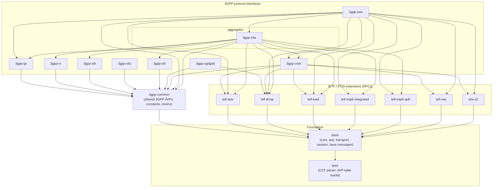

# Sparta Diameter

> ⚠️ **Work in Progress**
>
> This library is in active development. API surfaces may change between releases.

A Java library for the Diameter protocol (RFC 6733): message parsing and serialization, peer lifecycle management (CER/CEA, DWR/DWA, DPR/DPA), and a Netty-based transport layer for both server and client roles.

## Installation

Pick the modules you need. For example, to use the SGd/Gdd interface:

Maven:

```xml
<dependency>
    <groupId>com.sipgate</groupId>
    <artifactId>sparta-diameter-3gpp-sgdgdd</artifactId>
    <version>0.1.0</version>
</dependency>
```

Gradle (Kotlin DSL):

```kotlin
implementation("com.sipgate:sparta-diameter-3gpp-sgdgdd:0.1.0")
```

Gradle (Groovy DSL):

```groovy
implementation 'com.sipgate:sparta-diameter-3gpp-sgdgdd:0.1.0'
```

See the [Modules](#modules) table for the full list of artifacts.

## Java Version

Requires Java 17–24. **Java 25 is not supported** — compilation hangs or throws `OutOfMemoryError`.

## Project Goals

- RFC 6733 compliant Diameter message handling
- Implement the messages needed for our HSS and related applications
- Unknown messages are handled as `GenericCommand` and can still be processed
- Framework for building Diameter applications, including a potential DRA
- Open-sourced alongside our sparta-HSS project

## Modules

| Module | Contents |
|--------|----------|
| `sparta-diameter-base` | Core protocol, transport layer, session management |
| `sparta-diameter-3gpp-common` | Shared 3GPP constants and AVP mixins |
| `sparta-diameter-3gpp-s6a` | S6a interface (HSS–MME) |
| `sparta-diameter-3gpp-s6c` | S6c interface (SMS/MWD) |
| `sparta-diameter-3gpp-cxdx` | Cx/Dx interfaces (IMS HSS) |
| `sparta-diameter-3gpp-sgdgdd` | SGd/Gdd interfaces (SMS delivery via MO/MT) |

## Module Dependencies



- **Foundation:** `spec` (CCF parser, AVP-table model) → `base` (core, avp, transport, session, base messages).
- **IETF/ETSI extensions** each depend only on `base`.
- **`3gpp-common`** is the single shared 3GPP layer (shared AVPs, constants, mixins) on `base`.
- **Protocol modules** depend on `common` (and pick IETF modules as their command-code format requires). `swx` additionally depends on `gx`, `s6a`, and `cxdx` and reuses their shared AVP accessors rather than duplicating them.
- **`3gpp-s6a` is an aggregator:** it pulls `cxdx`, `gx`, `rx`, `s6t`, `slh` + IETF + mip6 because an S6a/S6d HSS typically co-deploys them.

## Development Status

- ✅ Core infrastructure: message parsing and serialization
- ✅ RFC 6733 base messages: CER/CEA, DWR/DWA, DPR/DPA, ACR/ACA, STR/STA, ASR/ASA, RAR/RAA
- ✅ Netty-based transport (`DiameterNode`, `DiameterPeer`)
- ✅ Session layer with capability negotiation, watchdog, reconnect timer (Tc)
- ✅ SGd/Gdd: MO-Forward-Short-Message, MT-Forward-Short-Message
- 🚧 S6a, Cx/Dx: constants and AVP definitions in progress
- 🚧 Comprehensive test coverage

## Usage

### Building a Server (Responder)

The server accepts inbound connections and handles requests. Use `DiameterNode.listen` with a `DiameterResponderSession` factory.

```java
final var config = new DiameterNodeConfig(
    "hss.example.com",
    "example.com",
    List.of(InetAddress.getByName("192.168.1.100")),
    10415L, // 3GPP vendor ID
    "sparta-hss",
    new DiameterNodeConfig.Capabilities(
        List.of(),
        List.of(),
        List.of((long) _3gppConstants.VENDOR_ID_3GPP),
        List.of(new DiameterNodeConfig.VendorSpecificApp(
            _3gppConstants.VENDOR_ID_3GPP,
            SgdGddConstants.APP_ID_SGD_GDD))
    )
);

try (final var node = new DiameterNode()) {
    final var serverFuture = node.listen(3868, () -> {
        final var session = new DiameterResponderSession(config);

        session.setHandler(MoForwardShortMessageRequest.In.class, request -> {
            final var answer = DiameterMessageFactory.createAnswer(
                request, DiameterConstants.RES_DIAMETER_SUCCESS);
            // populate answer AVPs here
            return CompletableFuture.completedFuture(answer);
        });

        return session;
    });

    serverFuture.sync(); // wait until the port is bound
    // keep running ...
}
```

### Building a Client (Initiator)

The client opens an outbound connection and can send requests. Use `DiameterNode.connect` with a `DiameterInitiatorSession` factory. The session automatically reconnects after the Tc timer fires when the connection drops.

```java
final var config = new DiameterNodeConfig(
    "smsc.example.com",
    "example.com",
    List.of(InetAddress.getByName("10.0.0.1")),
    10415L,
    "sparta-smsc",
    new DiameterNodeConfig.Capabilities(
        List.of(),
        List.of(),
        List.of((long) _3gppConstants.VENDOR_ID_3GPP),
        List.of(new DiameterNodeConfig.VendorSpecificApp(
            _3gppConstants.VENDOR_ID_3GPP,
            SgdGddConstants.APP_ID_SGD_GDD))
    )
);

try (final var node = new DiameterNode()) {
    node.connect("dra.example.com", 3868, reconnect -> {
        final var session = new DiameterInitiatorSession(config, reconnect);

        session.setHandler(MoForwardShortMessageRequest.In.class, request -> {
            final var userIdentifier = request.getUserIdentifier();
            final var smRpUi = request.getSmRpUi();
            // process the inbound MO SMS ...

            final var answer = DiameterMessageFactory.createAnswer(
                request, DiameterConstants.RES_DIAMETER_SUCCESS);
            return CompletableFuture.completedFuture(answer);
        });

        return session;
    }).sync();

    // Send a request once the session reaches I_OPEN:
    // final var future = session.send(outgoingRequest);
    // final var answer = future.get();
}
```

### Sending a Request

```java
final var request = DiameterMessageFactory.createRequest(
    MtForwardShortMessageRequest.Out.class);
request.setDestinationHost("hss.example.com");
request.setDestinationRealm("example.com");
request.setSmRpUi(encodedPdu);

final var answer = session.send(request).get();
```

### Working with AVPs

```java
// Typed access via message mixins
final var smRpUi = request.getSmRpUi();           // byte[]
final var originHost = request.getOriginHost();   // String
final var resultCode = answer.getResultCode();    // long

// Grouped AVP access
final var userIdentifier = request.getUserIdentifier(); // GroupedAVP
final var avp = userIdentifier.findAVP(
    new AVPKey(_3gppConstants.AVP_MSISDN, _3gppConstants.VENDOR_ID_3GPP));
```

## Key Classes

| Class | Role |
|-------|------|
| `DiameterNode` | Netty-based transport; `listen(port, factory)` / `connect(host, port, factory)` |
| `DiameterPeer` | Wraps a Netty channel; `send(answer)` / `send(request, h2h, e2e)` |
| `DiameterResponderSession` | Inbound session: handles CER, watchdog, routes requests to handlers |
| `DiameterInitiatorSession` | Outbound session: sends CER, handles reconnect via Tc timer |
| `DiameterNodeConfig` | Node identity, declared capabilities, protocol timers (TWINIT, Tc) |
| `DiameterMessageFactory` | Creates requests, answers, and error answers; auto-discovers message factories |
| `DiameterRequestHandler` | `CompletableFuture<Answer> handle(IncomingRequest)` — registered via `session.setHandler` |
| `GenericCommand` | Fallback for unknown command codes or application IDs |

## Metrics

See [docs/metrics.md](docs/metrics.md) for the full list of meters and their tags.

## Preparing a new release

We're using the [Maven release plugin](https://maven.apache.org/maven-release/maven-release-plugin/index.html).
When ready, run `mvn release:prepare` and follow the instructions. This will create, tag and push a new release.

We skip `release:perform` — the actual build and deploy to Maven Central happens in GitHub Actions when the tag lands (see `.github/workflows/publish-release.yml`). After a successful prepare, run `mvn release:clean` to remove `release.properties` and POM backups; otherwise the next `release:prepare` will try to resume the previous run.

## License

MIT. See the [LICENSE](LICENSE) file for details.
